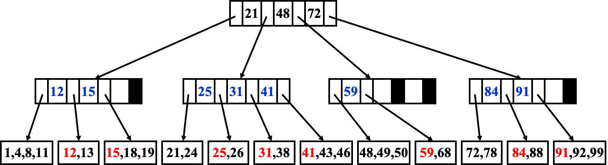

$M$ 阶 B+ Tree 是一种多路搜索树，它的每个节点最多有 $M$ 个子节点，每个节点的子节点数目比它的键数多一个。

B+ Tree 的所有数据都保存于叶子结点，非叶子节点只保存键值，用于索引。

::fold{title="$M$ 阶 B+ Tree" expand success}
1. 根节点要么是叶子节点，要么有 $2$ 到 $M$ 个子节点；
2. 所有非叶子结点（根节点除外），都有 $\lceil M/2 \rceil$ 到 $M$ 个子节点；
3. 所有叶子结点都有 $\lceil M/2 \rceil$ 到 $M$ 个数据。
4. 所有叶子结点都在同一层；
::

$3$ 阶 B+ 树又称 **2-3 树**，$4$ 阶 B+ 树又称 **2-3-4 树**。

