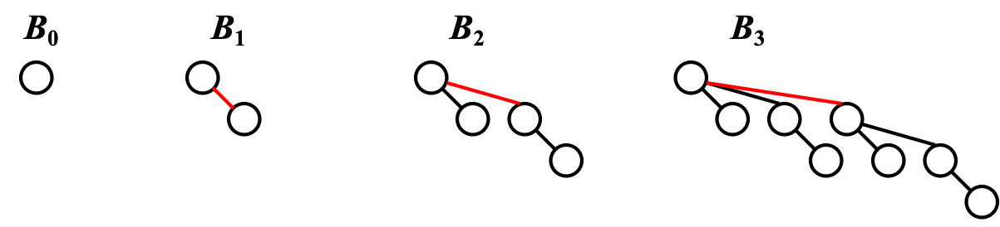

Binomial Queue 并非一棵树，而是一个由 Binomial Tree 组成的森林。其中 Binomial Tree 递归定义如下。

::fold{expand title="Binomial Tree" success}
 - A binomial tree of height $0$ is a one-node tree.
 - A binomial tree, $B_k$ of height $k$, is formed by attaching a binomial tree, $B_{k–1}$, to the root of another binomial tree, $B_{k–1}$.
::

显然，$B_k$ 高度为 $k$，有 $2^k$ 个节点，每一层的节点数满足二项式系数，且其根节点有 $k$ 个子树，分别是 $B_0, B_1, \ldots, B_{k-1}$。

Binomial Queue 类似于 size 的二进制表示，其中每一位对应一个 Binomial Tree。例如，$13 = 1101_2$，对应的 Binomial Queue 为 $B_3, B_2, B_0$。在进行 Merge 时，也就是普通的二进制加法。

在具体实现中，可用 Left-Child-Next-Sibling 表示法。
