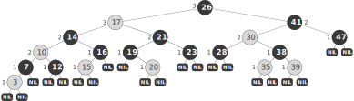

在二叉搜索树的基础上，给每个节点引入 $1$ 比特的颜色信息，并且让所有原本为 NULL 的指针都指向一个特殊叶节点 NIL，在此基础上满足如下规则，即为**红黑树**。

::fold{title="红黑树" expand success}
1. 每个节点不是红色就是黑色；
2. 根节点是黑色；
3. 所有叶节点 NIL 都是黑色；
4. 红色节点的子节点一定是黑色；
5. 从任意节点到其每个叶节点的路径上，黑色节点的数量相同。
::

下图为一个合法的红黑树（灰色代表红色节点）：

> NIL 的引入是为了方便边界情况的讨论。在实际应用中，为了节约空间，通常将叶节点指向同一个 NIL，把这个 NIL 作为树的属性之一。

---

## 树高复杂度

::fold{title="定理" expand success}
在一个有 $n$ 个内部节点（即不包括叶节点）的红黑树中，其高度至多为 $2\log(n+1)$。
::

称从节点 $x$ 到其每个叶节点的路径上的黑色节点数量（不包括该节点）为 $x$ 的 **Black-Height**，记为 $\operatorname{bh}(x)$。性质 5 保证了该定义的合理性。

---

首先，我们有如下引理：

::fold{title="引理" expand}
任何根节点为 $x$ 的子树至少包含 $2^{\operatorname{bh}(x)} - 1$ 个内部节点。
::

对树高进行归纳。

当树高为 $0$ 时，$x$ 为叶节点 NIL，$2^{\operatorname{bh}(x)} - 1 = 2^0 - 1 = 0$，满足条件。

当树高大于 $0$ 时，显然 $x$ 的左右子树的 Black-Height 一定是 $\operatorname{bh}(x)$ 或 $\operatorname{bh}(x) - 1$（取决于 $x$ 自身的颜色）。由归纳假设，各个子树至少包含 $2^{\operatorname{bh}(x) - 1} - 1$ 个内部节点。因此，以 $x$ 为根的树至少包含 $2 \times (2^{\operatorname{bh}(x) - 1} - 1) + 1 = 2^{\operatorname{bh}(x)} - 1$ 个内部节点。

引理得证。

---

设树高为 $h$。则由性质 4，在任何从根节点到叶节点的简单路径上，黑色节点的数量至少为 $h/2$（不包括根节点）。因此，根节点的 Black-Height 至少为 $h/2$。因此

$$
n \geqslant 2^{\operatorname{bh}(T)} - 1 \geqslant 2^{h/2} - 1
$$

简单变形后定理得证。

该定理保证了红黑树的高度是 $O(\log n)$ 的。

---

## 插入

首先以普通的二叉搜索树的方式插入节点 $z$，并将其颜色设为红色。然后调整树的结构（伪代码如下），使其满足红黑树的性质。

::fold{title="插入调整" expand success}
$$
\begin{align*}
    &\bold{while}\ z.p.\text{color} = \text{RED}: \\
    &\qquad \bold{if}\ z.p = z.p.p.\text{left}: \\
    &\qquad\qquad y \gets z.p.p.\text{right} \\
    &\qquad\qquad \bold{if}\ y.\text{color} = \text{RED}: \\
    &\qquad\qquad\qquad z.p.\text{color} \gets \text{BLACK} \\
    &\qquad\qquad\qquad y.\text{color} \gets \text{BLACK} \\
    &\qquad\qquad\qquad z.p.p.\text{color} \gets \text{RED} \\
    &\qquad\qquad\qquad z \gets z.p.p \\
    &\qquad\qquad \bold{else}: \\
    &\qquad\qquad\qquad \bold{if}\ z = z.p.\text{right}: \\
    &\qquad\qquad\qquad\qquad z \gets z.p \\
    &\qquad\qquad\qquad\qquad \text{Left-Rotate}(T, z) \\
    &\qquad\qquad\qquad z.p.\text{color} \gets \text{BLACK} \\
    &\qquad\qquad\qquad z.p.p.\text{color} \gets \text{RED} \\
    &\qquad\qquad\qquad \text{Right-Rotate}(T, z.p.p) \\
    &\qquad \bold{else}: \\
    &\qquad\qquad \text{Symmetrically.} \\
    &T.\text{root}.\text{color} \gets \text{BLACK} \\
\end{align*}
$$
::

---

## 删除

TBD.
